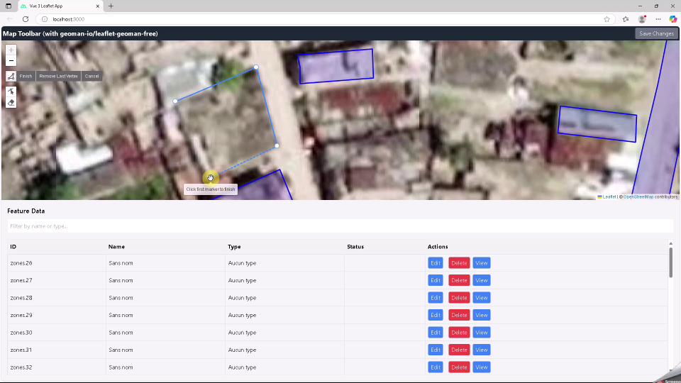
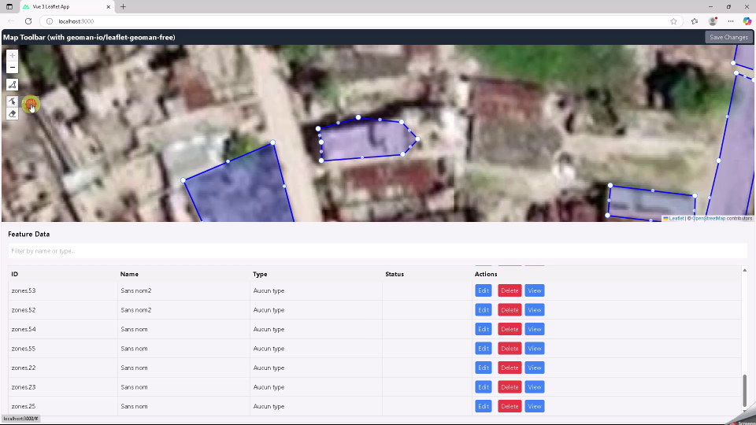

# Leaflet + Vue 3 WFS Layer Editor with Geoman

This project demonstrates how to integrate [Leaflet](https://leafletjs.com/) with [Vue 3](https://vuejs.org/) and [leaflet-geoman-free](https://github.com/geoman-io/leaflet-geoman) to edit a WFS (Web Feature Service) layer.

Users can load vector features from a WFS, draw or edit geometries on the map, and send updates via WFS-T to a GeoServer (or any compatible WFS-T server).

## ✨ Features

- Leaflet map integrated into a Vue 3 component
- WFS layer loading (via GeoServer)
- Geometry editing: draw, edit, delete
- Transactional WFS (WFS-T) support: send Insert, Update, Delete
- Leaflet-Geoman toolbar for editing
- Minimal UI and styling

## 🛠️ Technologies

- [Vue 3 + Vite](https://vitejs.dev/)
- [Leaflet](https://leafletjs.com/)
- [leaflet-geoman-free](https://github.com/geoman-io/leaflet-geoman)
- [GeoServer](https://geoserver.org/) (as a WFS-T backend)

## 📦 Installation

```bash
git clone https://github.com/voirinprof/gis_vue3_leaflet.git
cd gis_vue3_leaflet
npm install
npm run dev
````

## 🚀 Usage

1. Ensure you have a running GeoServer instance (or any WFS-T service) configured with the appropriate layer.
2. Update the WFS service URL and feature type in `.env`:

```js
VITE_WFS_URL=http://localhost/geoserver/geoimage/wfs
VITE_WFS_FEATURE_TYPE=geoimage:zones
VITE_WMS_URL=http://localhost/geoserver/geoimage/wms
VITE_WMS_LAYERS=geoimage:haiti
VITE_MAP_CENTER_LAT=18.188
VITE_MAP_CENTER_LNG=-73.753
VITE_DEFAULT_ZOOM=18
```

3. Start the app:

```bash
npm run dev
```

4. Use the map interface to:

   * View existing features from the WFS.
   * Create new geometries using Geoman.
   * Modify or delete features.
   * Send changes to the server via WFS-T.

## 🧩 Project Structure

```bash
├── src/
│   ├── router/
│   │   └── index.js  # navigation rules
│   ├── stores/
│   │   └── zones.js  # store for the WFS-T
│   ├── views/
│   │   └── HomeView.vue  # Main View
│   ├── components/
│   │   ├── Map.vue         # Map component
│   │   ├── DataTable.vue   # Table component
│   │   └── Toolbar.vue     # Toolbar component
│   ├── App.vue             # Root Vue component
│   └── main.js             # Application entry point
├── public/
├── index.html
├── .env  # config
└── vite.config.js
```

## 🧪 Notes

* WFS-T must be explicitly enabled for your layer in GeoServer.
* You can configure `leaflet-geoman` with options such as custom snapping, style, or edit modes.

## 🔐 Security

This is a demo project and does not include authentication or user management. In production, secure your WFS endpoints and consider using role-based access.

---

### Screenshots





---

### 🙌 Acknowledgments

* [Leaflet-Geoman](https://github.com/geoman-io/leaflet-geoman)
* [Leaflet](https://leafletjs.com/)
* [GeoServer WFS-T Guide](https://docs.geoserver.org/stable/en/user/services/wfs/transactions.html)